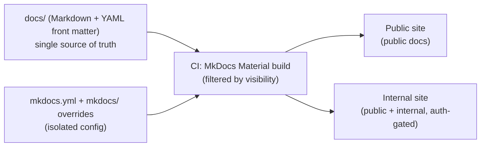

# Documentation Portal — Implementation Plan (M4)

> **Status:** Approved · **Owner:** Backend Team Lead · **Reviewers:** Frontend, Product · **Last updated:** 2026-07-21

The implementation **design** for the Documentation Portal. It realizes
[ADR-0005](../decisions/0005-documentation-portal-platform.md) (MkDocs Material) against
the frozen [portal requirements](documentation-portal-requirements.md), honoring the
ADR §10 Future Migration Strategy and principle **P9** (the repository is the source of
truth; the generator is disposable).

**This is a design document only. No configuration, code, or tooling is created by it.**
Implementation begins only after this plan is reviewed and approved. Illustrative
snippets below are *design intent*, not committed config.

---

## 1. Portal architecture



- **Source of truth:** the existing `docs/` tree — unchanged in structure (§12).
- **Config isolated from content:** all generator configuration lives outside `docs/`
  (ADR §10 rule 5), so swapping tools never touches documents.
- **Two build outputs** from one source, selected by a `visibility` front-matter field
  (§8): a Public site and an auth-gated Internal site.
- **Static output** hosted behind CDN/hosting (§10); the site is a build artifact only.

## 2. Repository layout

Content stays where it is; tooling is added *around* it:

```
level-up-backend/
  docs/                         # CONTENT — source of truth (unchanged tree)
  mkdocs.yml                    # portal config (isolated from content)
  mkdocs/                       # theme overrides, hooks, macros (isolated)
    overrides/                  # Material template partials (e.g., metadata banner)
    hooks/                      # build hooks (README→index, visibility filter)
  requirements-docs.txt         # pinned Python deps for the docs build
  .github/workflows/docs.yml    # CI: build + deploy
  Makefile                      # + docs-serve / docs-build targets
```

Rationale: `docs/` remains pure Markdown so any future generator re-reads the same tree
(ADR §10 rules 1, 3, 5). Everything MkDocs-specific is confined to `mkdocs.yml`,
`mkdocs/`, and the docs workflow.

## 3. MkDocs Material project structure

`mkdocs.yml` (design intent — not committed here):

```yaml
site_name: Level Up Documentation
docs_dir: docs
theme:
  name: material
  palette:                         # C7 light/dark with a toggle
    - scheme: default   # light
      toggle: { icon: material/weather-night, name: Dark }
    - scheme: slate     # dark
      toggle: { icon: material/weather-sunny, name: Light }
  features:
    - navigation.instant           # fast SPA-like nav (C8)
    - navigation.tracking
    - navigation.top
    - navigation.indexes           # section README as index (§5)
    - toc.follow                   # automatic TOC (C5)
    - search.suggest
    - search.highlight
    - content.code.copy
markdown_extensions:
  - admonition                     # callouts (C6)
  - pymdownx.details               # collapsible (C6)
  - pymdownx.superfences:          # Mermaid (§7) + nested code (C6)
      custom_fences:
        - { name: mermaid, class: mermaid, format: !!python/name:pymdownx.superfences.fence_code_format }
  - tables                         # (C6)
  - toc: { permalink: true }
plugins:
  - search                         # built-in full-text search (C4)
  # - awesome-pages                # tree-driven navigation (§5)
  # - git-revision-date-localized  # optional: auto Last Updated
```

Everything is standard Material — the point of ADR-0005 was that most requirements are
native, minimizing configuration and maintenance (C8).

## 4. Front matter schema

Realizes ADR-0005 finding **F3**: replace the human-only `> **Status:** …` blockquote
with **machine-readable YAML front matter** (portable across every candidate — ADR §10
rule 2). Proposed schema:

```yaml
---
title: <optional; falls back to the H1>
status: Draft | Review | Approved | Deprecated | Archived   # required (P8)
owner: <role or team>                                       # required (P7)
reviewers: [<role>, ...]                                    # optional
last_updated: YYYY-MM-DD                                    # required
version: <string>                                           # optional
visibility: public | internal | private                    # required (drives §8)
---
```

- **Machine-readable + reusable (C2):** any tool or script can read these fields.
- **Surfaced on every page (C2, "Documentation quality"):** a small Material template
  override (`mkdocs/overrides/`) renders a metadata banner (Status · Owner · Last Updated)
  at the top of each page from the front matter.
- **Default `visibility`:** **internal** when unset — safe by default; nothing is
  published publicly by omission.
- **Platform-neutral:** YAML front matter is the de-facto standard; migrating tools keeps
  the same fields (ADR §10).

## 5. Navigation generation

- **Tree-driven, not hand-maintained** — the `docs/` tree already mirrors the intended
  navigation, and files use ordered `NNN-` prefixes where sequence matters. Preferred:
  the **awesome-pages** plugin (or MkDocs native `nav:` if we choose explicit control),
  so adding a doc requires no nav edit (C8, scales to hundreds).
- **Folder index = `README.md`.** Our standard is README-as-folder-entry (and GitHub
  renders it). MkDocs treats `index.md` as the section index by default, so the build
  maps `README.md → index.md` via a small build **hook** (`mkdocs/hooks/`) — keeping the
  source unchanged (no mass rename, honoring §12 "little/no change to docs"). With
  `navigation.indexes`, section landing pages render from these.
- **Breadcrumbs, prev/next, TOC (C5):** native to Material; no extra work.
- **Cross-links (C5):** existing relative `*.md` links resolve natively; validated by a
  strict build (§9).

## 6. Search configuration

- **Material's built-in `search` plugin (C4)** — client-side, offline-capable, no
  external service. It is what Material is known for and scales to hundreds of docs.
- **No Algolia / hosted search** — avoids an external dependency and keeps the build
  self-contained (C8, and no third-party coupling).
- Language: English (matches the docs; ADR-0002).

## 7. Mermaid support

- Our docs already use fenced ```mermaid blocks (e.g. `PRODUCT_MODEL.md`).
- Enabled via **`pymdownx.superfences` custom fence** (see §3) → Material renders them
  with mermaid.js client-side (C6). This is Material's documented, native path — no bespoke
  integration.
- Portability: fenced ```mermaid is part of our portable Markdown subset (ADR §10 rule 4),
  so diagrams survive a tool change.

## 8. Internal / Public visibility strategy

Realizes ADR-0005 finding **F1**: access control is a **build-and-hosting** concern, not
an SSG feature. Design:

1. **Every doc declares `visibility`** in front matter (§4): `public | internal | private`.
2. **Build-time filtering** — a MkDocs **hook** (`mkdocs/hooks/`) drops pages whose
   visibility is not permitted for the target build:
   - **Public build:** includes only `public`.
   - **Internal build:** includes `public` + `internal`.
   - **`private`:** excluded from both site builds by default; surfaced only in a
     restricted internal build if ever needed.
3. **Hosting enforces the boundary (§10):** the Public site is publicly reachable; the
   Internal site sits behind authentication. Build filtering ensures internal/private
   content is **never emitted** into the public artifact (defense in depth — not just
   hidden by auth).
4. **Safe default:** unset visibility ⇒ `internal`, so a new doc is never accidentally
   public.

This pattern is tool-agnostic and outlives MkDocs (ADR §10).

## 9. CI/CD build pipeline

`.github/workflows/docs.yml` (design intent):

- **Trigger:** push to `master` touching `docs/**`, `mkdocs.yml`, `mkdocs/**`, or the
  workflow (builds automatically from Git — C8).
- **Steps:**
  1. checkout · setup Python · `pip install -r requirements-docs.txt` (pinned — reproducible, low-maintenance).
  2. `mkdocs build --strict` for the **Public** target (visibility=public) → fails on any
     broken link or warning (link-integrity gate, C-quality).
  3. `mkdocs build --strict` for the **Internal** target (public + internal).
  4. Deploy each artifact to its host (§10).
- **Pinned dependencies** in `requirements-docs.txt` keep builds deterministic and
  maintenance minimal (C8).
- Optional: a PR check that builds (without deploy) so docs breakage is caught before merge
  — consistent with the Definition of Done.

## 10. Hosting strategy

- **Public site:** a static host — **GitHub Pages** (already used by the project) or
  **Cloudflare Pages**. Public, CDN-backed, shareable links (C9).
- **Internal site:** a static host **behind authentication** — recommended **Cloudflare
  Pages + Cloudflare Access** (email/domain-gated, low-maintenance) or an equivalent
  password/SSO-gated host. Meets access control (C3) without custom infrastructure.
- **Domains:** a docs subdomain/subpath (e.g. `docs.…` public, `docs-internal.…` gated) —
  exact naming decided at implementation.
- **Private:** if ever needed, a further-restricted internal deployment; excluded from
  both standard builds by default (§8).

Hosting choices are the **only** platform-external decision and are deliberately kept
swappable (static output runs anywhere).

## 11. Local development workflow

- **Live preview:** `mkdocs serve` → `http://localhost:8000`, hot-reloads on save.
- **Makefile targets** (consistent with the repo's `make` conventions):
  - `make docs-serve` — live preview.
  - `make docs-build` — strict build (mirrors CI) for pre-push checks.
- **Setup:** a Python virtualenv (or `pipx`) with `requirements-docs.txt`; documented in
  the docs README so any contributor can run it.
- **Authoring is unchanged:** contributors write Markdown in `docs/` exactly as today; the
  portal is a view, not a new editing surface (P9).

## 12. Migration path from the current `docs/` directory

The earlier discipline pays off here: **content does not move** (ADR §10). Ordered steps:

1. **Add tooling (no content change):** `mkdocs.yml`, `mkdocs/` (overrides + hooks),
   `requirements-docs.txt`, Makefile targets, CI workflow.
2. **Front-matter migration (the one content change):** convert each doc's `> **Status:**
   …` blockquote header to the YAML front matter schema (§4) — mechanical, ~40 docs,
   scriptable, one PR. This is the F3 change flagged in ADR-0005.
3. **README-as-index hook:** add the build hook (§5) so folder `README.md` files become
   section indexes — **no renames** of source files.
4. **Link validation:** run `mkdocs build --strict`; fix any relative-link edge cases
   (our links are already relative `*.md`, which MkDocs resolves). CI keeps this green.
5. **Visibility tagging:** set `visibility` on each doc (default `internal`); mark the
   public subset explicitly (§8).
6. **Wire hosting + CI deploy** (§9, §10); validate Public and Internal builds.
7. **Cutover:** announce the portal URLs; `docs/` remains the source of truth and the
   GitHub tree stays browsable as a fallback.

**Reversibility check (ADR §10 rule 6):** after migration, replacing MkDocs Material means
re-implementing `mkdocs.yml` + `mkdocs/` + workflow for another tool and pointing it at the
same `docs/` + front matter — the documentation itself does not change.

---

## Risks & open questions (to resolve during implementation, not now)

- **README→index mechanism** — confirm the hook vs. `awesome-pages`/`navigation.indexes`
  combination that keeps source `README.md` unchanged.
- **`use_directory_urls` + relative links** — validate all cross-doc links under strict
  build; decide URL style.
- **Metadata banner override** — the Material template partial that surfaces
  Status/Owner/Last Updated (C2).
- **Exact hosting + auth** for the Internal site (Cloudflare Access vs. alternatives).
- **Front-matter migration script** — author + review before running across ~40 docs.
- Whether the front-matter schema (§4) graduates into a small standard under
  `docs/standards/` once settled.

## Phasing (proposed for the M4 implementation milestone)

1. **P1 — Local build:** `mkdocs.yml` + Material + Mermaid + search + README-index hook;
   `mkdocs serve` renders the whole tree locally. No hosting.
2. **P2 — Front matter + metadata surfacing:** migrate headers to front matter; add the
   metadata banner; strict build green.
3. **P3 — Visibility + dual build:** visibility field + build-time filter; Public/Internal
   artifacts.
4. **P4 — CI/CD + hosting:** workflow + Public host + gated Internal host; shareable links.
5. **P5 — Cutover + docs:** document the workflow; announce URLs.

Each phase is independently reviewable and leaves `docs/` as the source of truth
throughout.
