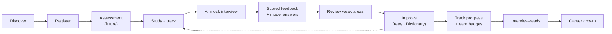
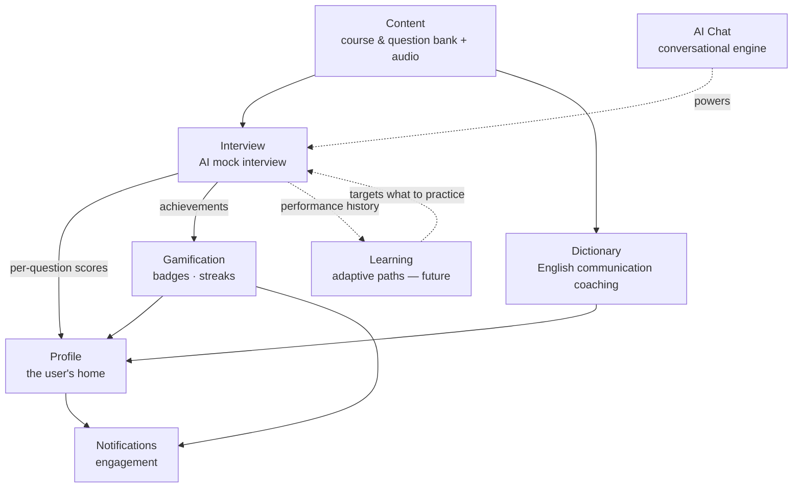

# Level Up — Product Model

> **Status:** Approved · **Owner:** Product / feature lead · **Reviewers:** Backend, Frontend, Mobile, Design · **Last updated:** 2026-07-21

This is the **single source of truth for what Level Up is and why it exists.** All
product documentation — feature specs, PRDs, UX specs, roadmaps — is **derived from
this model**, and every product decision must trace back to it. If a decision
conflicts with this model, either the decision is wrong or the model must be updated
first (and then the decision revisited).

## What kind of product this is (framing)

Four statements frame everything below:

1. **Level Up is an AI-powered learning platform — not a collection of features.**
   Courses, interviews, chat, dictionary, badges are not separate tools bolted
   together; they are surfaces of one learning system.
2. **AI acts as a mentor and coach — not an answer generator.** The AI teaches,
   questions, evaluates, and encourages. It never hands over answers to be used in a
   real interview, and it never grades out loud mid-conversation.
3. **Learning, Interview, AI Chat, Dictionary, and future modules form one connected
   ecosystem.** Data and value flow between them; the whole is worth more than the
   parts.
4. **This Product Model is the single source of truth for all product documentation.**
   Documentation is derived from it, never the reverse.

---

## 1. What is Level Up?

**A practice-first, AI-powered platform where software engineers become
interview-ready by rehearsing with an AI coach.** A user picks a track (Backend,
Frontend, DevOps, QA, Node, Go, React, Next), studies a curated question bank, then
runs realistic AI mock interviews that ask one question at a time, score each answer
on a rubric, and coach them with model answers — with English-communication practice
for non-native speakers, gamified progress, and personalized learning paths (evolving).

## 2. Why does it exist?

Engineers fail interviews less from a lack of knowledge than from a lack of
**realistic practice, immediate feedback, and — for many — communication skill**. The
status quo is static question lists and passive video courses: no rehearsal, no
expert feedback, no personalization, no measure of progress. Level Up exists to make
**deliberate interview practice with instant, expert-level coaching repeatable and
accessible** — so improvement is a loop the user can actually run, not a hope.

## 3. Who is it for?

**Software engineers, junior through senior, preparing for technical interviews**,
across eight tracks. A defining segment is **non-native-English-speaking developers
interviewing in English** (reflected in the trilingual product — English, Russian,
Armenian — and the Dictionary's communication coaching). For them, the challenge is
two-fold: know the answer, and be able to say it well under pressure.

## 4. What problems does it solve?

| Problem | How Level Up solves it |
|---|---|
| No realistic place to practice | AI mock interviews that behave like a real interviewer |
| Can't self-assess; no feedback | Rubric scoring (Correctness · Depth · Communication · Structure) + written coaching + model answers |
| Knowing ≠ articulating (esp. non-native English) | Dictionary: vocabulary, pronunciation, interview phrasing, communication coaching |
| No structured, personalized path | Curated tracks today; adaptive, personalized learning as the ecosystem matures |
| Motivation & consistency | Gamification — badges, streaks, visible progress |

## 5. Core principles

These constrain every product decision:

- **Learn by doing** — practice is the product, not an add-on to lectures.
- **Practice before theory** — rehearse, then fill gaps.
- **AI is a mentor, not an answer machine** — it coaches and questions; it never
  supplies answers for real-interview use, and hides scores mid-conversation.
- **Personalized learning** — the platform adapts to the individual (per-answer
  performance is captured from day one to enable this).
- **Continuous feedback** — every answer produces a signal the user can act on.

## 6. The complete user journey

Every stage but *Assessment* is live today; the loop from **Improve** back into
**Study/Practice** is where the platform's compounding value lives.

## 7. How the modules relate — one ecosystem

- **Content** feeds the Interview's questions and self-study.
- **AI Chat** *is* the Interview's conversational engine (evolving: HTTP → streaming →
  voice → realtime).
- **Interview** emits per-question rubric scores that flow to **Profile** (performance),
  **Gamification** (badges/streaks), and **Learning** (future adaptive targeting).
- **Dictionary** coaches *how* the user communicates — delivery, not correctness.
- **Profile** is the user's home: progress, performance, achievements, saved questions.
- **Gamification + Notifications** close the engagement loop.
- **Learning** (future) turns the already-persisted per-question history into
  personalized paths that feed back into what the Interview asks next.

## 8. The role of AI across the platform

AI is the platform's mentor, present in scoped, well-defined roles:

- **Interviewer** — paraphrases bank questions into natural, conversational questions,
  calibrated to difficulty.
- **Evaluator** — scores each answer on the rubric and writes coaching feedback plus a
  model answer.
- **Conversational partner** — natural reactions and token-by-token delivery, evolving
  toward voice and realtime.
- **Communication coach** — English coaching through the Dictionary and future Learning
  Profile.
- **Voice** — transcribes spoken answers so the user can practice speaking.

**Guardrails (non-negotiable):** the AI is a *mentor, not an answer machine* — it does
not feed answers for real-interview use; it never grades out loud mid-chat; it degrades
gracefully and never blocks the experience on an AI failure; and every AI call runs
server-side with the provider key never exposed to clients.

## 9. Boundaries — what is intentionally out of scope

Level Up is **not**:

- ❌ a job board or recruiting platform;
- ❌ a real-interview assistance/cheating tool (no live answer-feeding);
- ❌ a general-purpose LLM chatbot (the AI is scoped to interview & learning coaching);
- ❌ a video-lecture course platform (practice-first, not lecture-first);
- ❌ a resume builder or applicant-tracking tool.

Naming these keeps scope honest and protects the "mentor, not answer machine" principle.

## 10. Long-term vision (≈ 3 years)

- **Realtime voice AI interviews** — a spoken, low-latency mock interview (the
  streaming → voice → realtime path is already in motion).
- **Adaptive, personalized learning** — driven by each user's per-question performance
  history (captured from day one).
- **Full English-communication coaching** — a personalized Dictionary / Learning
  Profile for non-native speakers.
- **Mobile** — the ecosystem on phones (the documentation architecture already
  anticipates it).
- **Company- and role-specific interview modes.**

The through-line: Level Up grows from "practice interviews with an AI" into a
**personalized, multi-modal learning ecosystem** that knows each user and coaches them
toward career growth.

---

## Using this model

- **Deriving documentation:** the product documentation hierarchy (vision, principles,
  philosophy, audience, user journey, feature map, roadmap, and each feature's spec) is
  derived from the sections above — each section is the seed of one or more documents.
  Do not write a product document that is not traceable to this model.
- **Keeping it true:** when the product changes, update this model first, then the
  documents derived from it. This model is `Approved` and is the reference the rest of
  `docs/product/` points back to.
