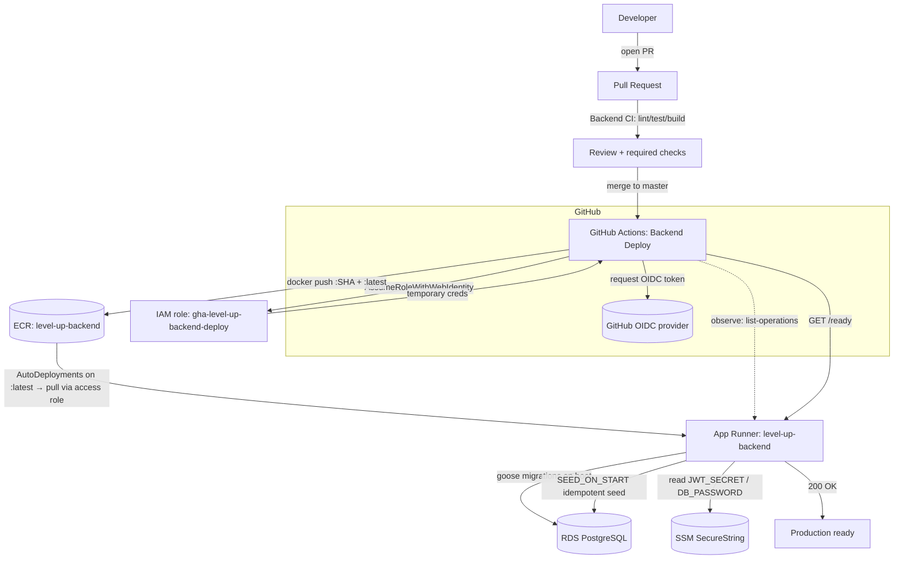

# DevOps Architecture — OIDC backend deployment

Production-grade, keyless deploy of the Go API (`apps/api`) to AWS App Runner, driven
entirely by merging to `master`. All of it is Infrastructure as Code in [`infra/`](https://github.com/ArtashMardoyan/level-up/tree/master/infra).

## Diagram

## Deployment flow

1. Developer opens a PR → **Backend CI** (`lint`, `test`, `build`) runs and must pass.
2. Reviewer approves; branch protection requires the checks + approval.
3. Merge to `master` triggers **Backend Deploy** (`.github/workflows/backend-deploy.yml`).
4. The job runs in the `production` GitHub environment and requests a short-lived OIDC token.
5. It assumes the IAM role via `AssumeRoleWithWebIdentity` → temporary AWS credentials (no stored keys).
6. Build image → push `:<sha>` and `:latest` to ECR.
7. App Runner **AutoDeployments** detects the new `:latest` and pulls the image via its access role.
8. On boot the container runs **goose migrations under a Postgres advisory lock** (only one instance
   migrates at a time), then (if `SEED_ON_START=true`) the **idempotent seed**.
9. The workflow waits for the new deployment operation to `SUCCEED`, then health-checks `GET /ready` → 200.
10. Production ready.

## AWS resources (all in `infra/`)

| Resource | Terraform | Purpose |
|---|---|---|
| GitHub OIDC provider | `infra/oidc` | Lets GitHub Actions federate into AWS |
| IAM role `gha-level-up-backend-deploy` | `infra/oidc` | Assumed by CI; least-privilege deploy |
| ECR repo `level-up-backend` (+ lifecycle) | `infra/aws` | Stores API images; keeps last 15 |
| App Runner service `level-up-backend` | `infra/aws` | Runs the API; auto-deploys on `:latest` |
| IAM role `…-apprunner-access` | `infra/aws` | App Runner pulls from ECR |
| IAM role `…-apprunner-instance` | `infra/aws` | Runtime role; reads SSM secrets |
| SSM SecureString `/level-up-backend/JWT_SECRET`, `/DB_PASSWORD` | `infra/aws` | Secrets, referenced by the service |
| GitHub repo variables + `production` environment | `infra/github` | Wires the workflow; no secrets |

RDS PostgreSQL is treated as pre-existing (managed outside this stack); its host is an input variable.

See [github-oidc.md](github-oidc.md) (security/trust), [aws-setup.md](aws-setup.md) (setup),
[deployment.md](deployment.md) (pipeline/variables), [rollback.md](rollback.md).
